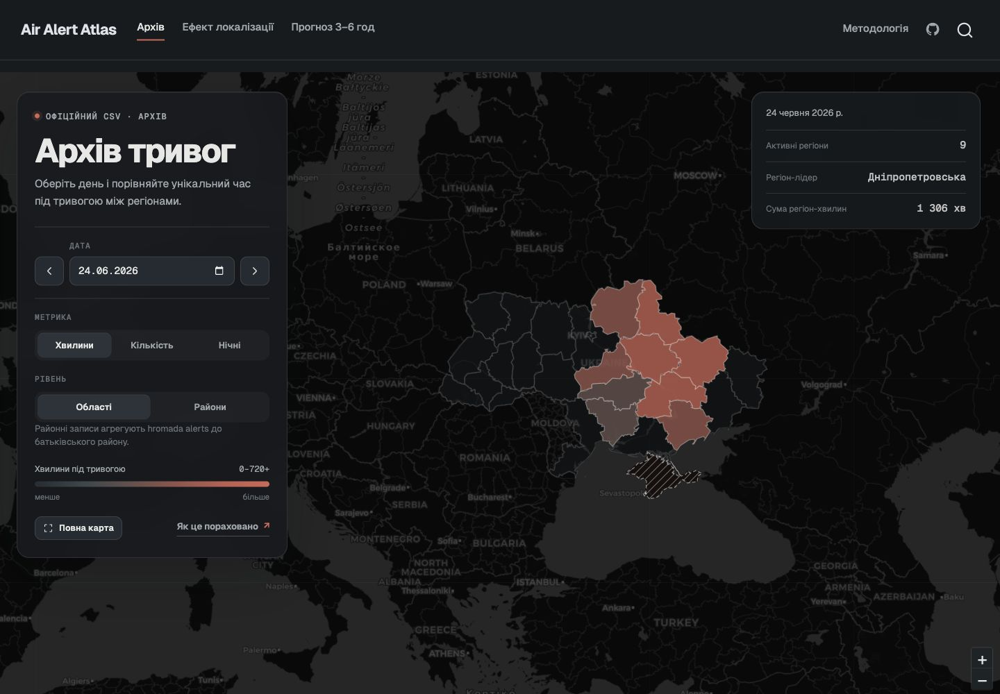
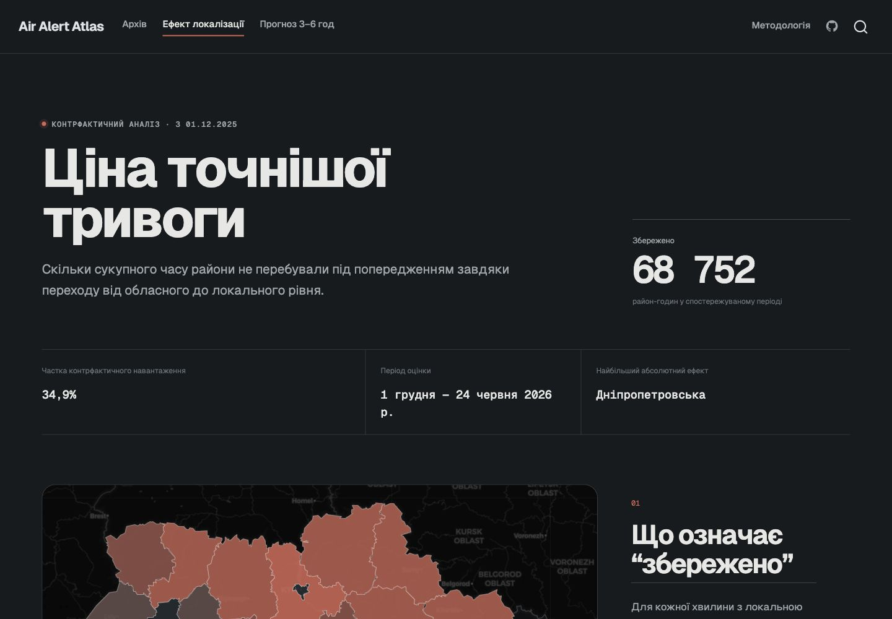

# Air Alert Atlas Ukraine

[View the live GitHub Pages site](https://tymof1j.github.io/ai-stage2/)

## Preview

| Archive map | Localisation effect |
| --- | --- |
|  |  |

A reproducible Python and Quarto project for exploring historical air-alert activity in Ukraine, estimating the alert exposure avoided by the transition to raion-level warnings, and producing a short-horizon snapshot forecast of national alert-system load.

## Why this matters for defense tech

Air-alert data is a real operational signal: it describes how often the warning system is stressed, where alert exposure accumulates, and how much precision is gained when warnings move from oblast-level to raion-level geography. For a deftech/miltech audience, this project is useful because it turns public interval data into measurable decision support rather than a static chart:

- **Operational load awareness:** the 3–6 hour forecast estimates aggregate alert-system load, which is safer and more testable than trying to predict strikes or exact locations.
- **Policy evaluation:** the localisation page quantifies avoided alert exposure in raion-hours, making the effect of more targeted warnings auditable.
- **Reproducible OSINT pipeline:** every number is produced from public data, code, tests, and documented assumptions, so the analysis can be reviewed or extended.

For civilians, the value is different but still important: the archive makes historical alert burden visible, helps compare regions and nights, and explains why a forecast snapshot must never replace official alerts.

## Three analytical pages

1. **Archive** — a day-by-day oblast/raion map with calendar navigation and multiple metrics.
2. **Localisation effect** — a counterfactual comparison between observed targeted alerts and an oblast-wide warning policy.
3. **3–6 hour forecast** — a static snapshot forecast of the share of monitored raions under alert.

The forecast is not live: it is anchored to the final complete hour in the downloaded CSV. Real-time updating requires an approved API token, which is not bundled with the repository. Nothing in this project is a public-warning or safety signal.

## Reproduce

```bash
python3 -m pip install -r requirements.txt
make check
make data
quarto render
```

The rendered site is written to `_site/`.

## Data

- Alert intervals: [`Vadimkin/ukrainian-air-raid-sirens-dataset`](https://github.com/Vadimkin/ukrainian-air-raid-sirens-dataset)
- Administrative boundaries: OCHA Ukraine COD-AB v05 via ArcGIS Feature Service

See [`data/raw/README.md`](data/raw/README.md) and the methodology page for provenance, definitions, limitations, and checksums.

## Repository structure

```text
assets/         browser-side map, charts and styling
data/raw/       immutable input snapshot
data/geo/       simplified OCHA boundaries
site-data/      generated compact JSON used by the site
src/            interval, counterfactual and forecasting logic
scripts/        reproducible build entry points
tests/          interval-algebra regression tests
*.qmd           Quarto pages and reproducibility report
```
